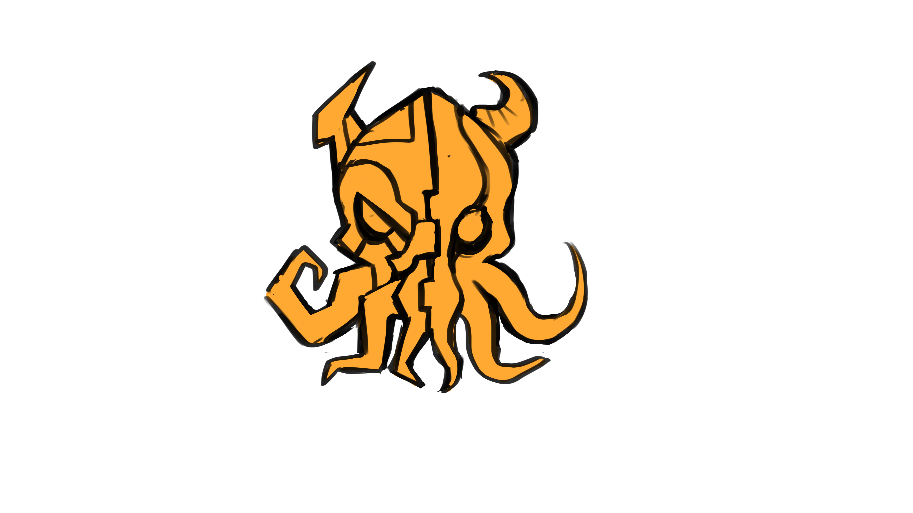

<div align="center">


# G A O L

**An otherworldly storyweaver bringing drama and adventure to the realms of his creation.**


<br />

<p>
  Embark on adventures with a party of up to 6 players through persistent worlds. <br/>
  You define your characters, ambitions, and even the secrets you keep from your allies.<br/>
  <b>GAOL will determine the fate of your characters actions and outcomes.</b>
</p>
</div>

GAOL is a multiplayer AI storyteller based on the *AI Dungeon* Multiplayer and *Death By AI* gameplay. GAOL uses a turn-based system where all player inputs are taken into account to determine the course of action, and uses a novel status system to update your characters and the world as a result.
##  Key Features

### Persistent Worlds
Worlds are persistent, living, and richly defined.
* **History:** Wars, disasters, epidemics, all major historical events are chronicled by GAOl. Your journey will be influenced by those who came before you, and may influence future adventurers.
* **Figures:** World figures such as gods, kings, and mythical beings will have influence on the world. Their presence will influence the world and how it behaves. 
* **Factions:** Factions and the influence will affect the way you may conduct yourselves. Be subjugated as slaves of an empire, or tracked down by vampire hunters, the world will treat you as it sees fit.
* **Landmarks:** Explore, visit and discover locations across the world. Cities, monuments, graves, and anything else GAOL deems worth marking. 
* **Scope:** Worlds are defined with sizes, so that locations can be marked with coordinates and to give them a vast sense of scale for your journey.

### Deep Characterization
Begin each journey by defining your character with a summary, tags, ambition, and secrets.
* **Active Tracking:** Every bit of information is weighed during story generation.
* **Evolution:** Summaries, tags, and statuses update automatically as you adventure.

### Multiplayer Party
Supports **up to 6 players** with support for hot-dropping and hot-joining.
* **Collective Storytelling:** The irreverent GAOL remains impartial, weighing every player's choice.
* **Co-op:** Players *may* work together, although conflicting ambitions and clandestine secrets may cause friction...


### The Dice Will Decide
Your actions will be weighed by the roll of a D20. Keep in mind the dice don't decide everything, and GAOL may have plans of his own with your choices...

## How does it work?
GAOL uses the Gemini API, specifically the `Gemini-2.5-flash-lite` model. GAOL's server is set up with very detailed and explicit instructions to provide the API which return not just text, but a JSON object that is parsed to provide both the generated story text, and a list of updates to be done across characters and the world. These updates are reflected on the data sheets, character sheets are frequently updated and major events can even change the world sheet.

### Tech Stack

| Component | Technology | Description |
| :--- | :--- | :--- |
| **Backend** | Python / Flask | Handles API calls, state management, and game rooms (`app.py`). |
| **Frontend** | React / Vite | A frontend "tabletop" esque environment. (`./client`). |

---

## Setup
GAOL can be set up on a dedicated server, or run locally to play around with the functionalities. Before anything, you should fill create and fill out a `.env` file in the project root.
```env
# OPTIONAL: Can also be provided via the client UI
GEMINI_API_KEY=<get from Google AI Studio>

# REQUIRED: Arbitrary key for Flask CORS
SECRET_KEY=<randomized password>

# REQUIRED: Point this to your backend or leave it for local hosting
VITE_SOCKET_URL=http://localhost:5000
```
Setting the `GEMINI_API_KEY` in the `.env` provides a server backup for all created rooms, these can be overridden when creating rooms with your own key. If you intend to publicly host a GAOL instance I recommend leaving this blank and forcing users to use their own API keys.
  
The `VITE_SOCKET_URL` can be left as is if running locally, and will just host the server on port 5000. If you move this to a publicly accessible server, replace this field with your websites URL (I use https://gaol.jfelix.space in my case). 

### Makefile
A makefile has been provided for rebuilding and updating GAOL from the Github codebase. In my production environment I run an NGINX proxy and a system service named `gaol`, this is what controls my Gunicorn service to enable multi-threading on the Flask API. If you intend to create a public instance of GAOL I recommend you use a similar set up, I won't go into detail here as this requires much more instruction.

### Running Locally
**Client**  
From `./client` :
```
npm install
npm run dev
```
 
This will run a vite development environment on port 5173.  

**Server**  
From the project root:
```
python -m venv .venv
source .venv/bin/activate        # On Windows: .venv/Scripts/activate
pip install -r requirements.txt
python app.py
```
This will run the server backend for the API calls on port 5000.

## Feedback
Please let me know if you run into any bugs or issues by messaging me, or opening an issue here on GitHub!